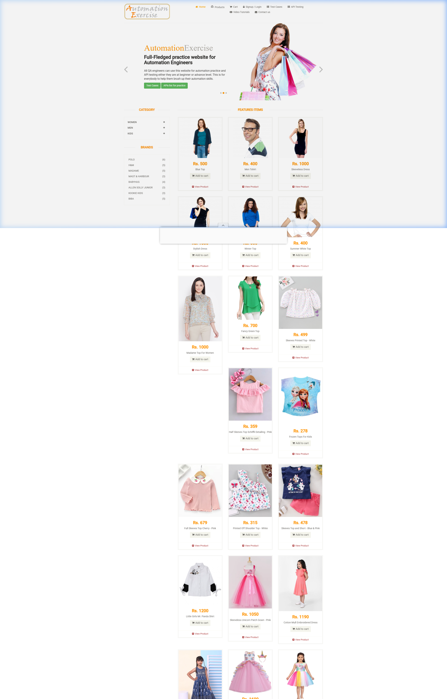

# Professional QA Automation Framework - Cypress & TypeScript

**English 🇺🇸** | [Español 🇪🇸](README.es.md)

## 🌟 Featured Project: Multi-Browser E2E Suite

This repository showcases a **production-grade E2E and API automation suite** designed for scalability and resilience. It validates critical business flows for [Automation Exercise](https://automationexercise.com/) using industry-standard engineering patterns.

---

## 🎯 Testing Strategy

The framework prioritizes critical business flows using a layered validation strategy:

- **E2E Tests** for complete, high-value user journeys.
- **API Tests** for backend validation and early failure detection (Shift-Left approach).
- **Mobile & Responsive Validation** to ensure UI integrity across different devices.
- **Cross-browser execution** to ensure rendering and functional consistency.
- **Independent & Atomic Tests** to avoid shared state dependencies and ensure reliable parallel execution.
- **Deterministic Synchronization** using network interception (`cy.intercept`) instead of static waits.

---

## 🚀 Key Engineering Features

*   **Page Object Model (POM) Architecture:** Strict separation of test logic from UI interaction layers.
*   **Hybrid UI + API Validation:** Comprehensive coverage including interface flows and independent REST endpoint validation.
*   **Cross-Browser Capability:** Suite configured for parallel execution on **Chrome, Firefox, and Edge**.
*   **Mobile & Responsive Testing:** Support for validations across different **Viewports** (Mobile, Tablet, Desktop).
*   **Dynamic Data Generation:** Integration with **Faker.js** for realistic and varied test scenarios.
*   **Dynamic Test State Recovery:** Resilience mechanism that automatically restores user states (login/registration) if altered by previous runs.
*   **Network Interception:** Direct control over XHR/Fetch traffic for precise synchronization.
*   **Enterprise CI/CD Pipeline:** Integrated with GitHub Actions using a Matrix Strategy for parallel browser execution.

---

## 🧪 Automated Coverage (+40 Scenarios)

| Module | Scenarios | Type | Status |
| :--- | :---: | :---: | :---: |
| **Authentication** | 4 | UI / E2E | ✅ Passing |
| **User Registration** | 2 | UI / E2E | ✅ Passing |
| **Cart Management** | 4 | UI / E2E | ✅ Passing |
| **Checkout Flow** | 5 | UI / E2E | ✅ Passing |
| **Product Search** | 3 | UI / E2E | ✅ Passing |
| **API Testing** | 14 | Backend | ✅ Passing |

---

## 💡 Engineering Decisions & Best Practices

*   **Cross-Browser Insights:** Parallel execution uncovered rendering and synchronization inconsistencies specific to **Firefox**, validating the effectiveness of the multi-browser strategy.
*   **Scalable Locators:** Priority use of `data-qa` attributes to ensure test stability.
*   **Performance Optimization:** Strategic use of `blockHosts` to mitigate ad-trackers, resulting in a ~30% execution speed improvement.
*   **Deterministic Testing:** Replaced fixed `cy.wait(N)` with network-aliasing to ensure tests only proceed when requests resolve.

---

## 📸 Framework Execution Evidence

### CI/CD Pipeline (GitHub Actions - Matrix Execution)

*Real-time parallel execution across Chrome, Firefox, and Edge browsers.*

### Full Test Suite Results (+40 Scenarios)

*100% pass rate across all environments, validating E2E and API layers.*

### Test Execution & UI Validation

*Automated validation of critical flows on the [Automation Exercise](https://automationexercise.com/) platform.*

> [!TIP]
> You can find a full video execution of the authentication suite in [docs/img/execution.mp4](docs/img/execution.mp4).

---

## ⚙️ CI/CD Workflow

The suite runs automatically on:
*   **Push** to main branches.
*   **Pull Requests**.
*   **Scheduled Runs:** Every Monday at 08:00 AM UTC.

---

## ▶️ Local Execution

1.  **Clone:** `git clone https://github.com/Arrobajean/cypress-portafolio.git`
2.  **Install:** `npm install`
3.  **UI Mode:** `npm run cypress:open`
4.  **Headless:** `npm run test`

---

## 👨‍💻 About the Author

**Jean** — *QA Automation Engineer*

Focused on building scalable E2E frameworks, API testing, and CI/CD automation using Cypress and TypeScript. Committed to software quality and resilient automation architectures.

[LinkedIn](https://www.linkedin.com/in/jeancastanedah/) | [GitHub](https://github.com/Arrobajean)
